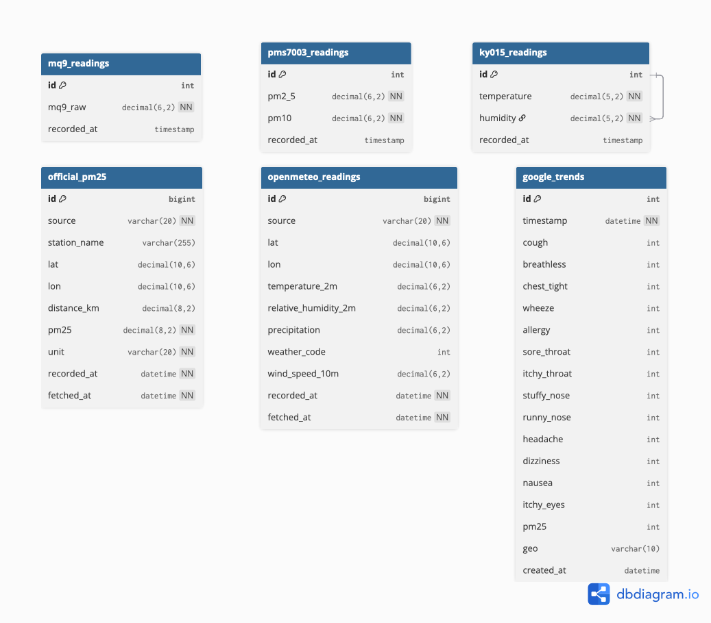

# AirHealth Monitor


**Turning Environmental Data into Meaningful Health Insights**

> Team 11 — Honey
> · Karnpon POOCHITKANON · Thitirat SOMSUPANGSRI

---

## Overview

AirHealth Monitor is a smart data acquisition and analytics system that explores how air quality influences everyday health conditions. The system continuously collects environmental data from real-world sensors installed in locations such as dormitories, homes, or university buildings, then combines those readings with trusted public datasets to uncover patterns between air pollution, weather, and health-related concerns.

Rather than exposing raw numbers, AirHealth Monitor transforms sensor readings into understandable indicators, visual insights, and predictive information that ordinary users can easily interpret — bridging the gap between environmental sensing and personal well-being.

---

## Database Schema



---

## Presentation Slide

- [AirHealth presentation slide (PDF)](./component/Airhealth.pdf)

---

## Node-RED And Database

- Node-RED flow: `https://iot.cpe.ku.ac.th/red/b6710545563`
- phpMyAdmin database: `b6710545563`

---

## Data Sources

### Primary — On-site Sensors

| Module   | Sensor Name                        | Qty | Measures |
|----------|------------------------------------|-----|----------|
| PMS7003  | PM2.5 / PM10 Dust Sensor           | 1×  | Fine and coarse particulate matter (PM2.5, PM10) concentration |
| KY-015   | Temperature & Humidity Sensor      | 1×  | Ambient temperature and relative humidity |
| MQ-9     | Carbon Monoxide (CO) Sensor        | 1×  | CO concentration from exhaust / incomplete combustion |
| —        | Automatic Timestamp Logger         | —   | Exact date and time of every reading |

### Secondary — External APIs

| Source              | Purpose |
|---------------------|---------|
| **Google Trends API** | Monitor search interest for health keywords in Thailand (headache, cough, difficulty breathing, PM2.5) |
| **IQAir / OpenAQ API** | Obtain nearby official PM2.5 / AQI measurements for comparison and validation |
| **Open-Meteo API**   | Provide supplementary weather data to support environmental interpretation |

---

## What the API Provides

The API delivers processed, health-relevant outputs rather than raw measurements.

### Key Questions Answered

- What is the **current health risk score** based on live PM2.5, PM10, CO, temperature, humidity, and official PM2.5 data?
- Over the past **7 days**, how have PM2.5, PM10, and CO changes related to illness-related search trends?
- What do **recent weather conditions** such as rain and wind suggest about short-term PM2.5 behavior?
- At what **times of day** does air quality become most concerning in a specific location?
- How do **local PMS7003 readings compare** with nearby official PM2.5 measurements?
- What is the **next 6-12 hour forecast** for PM2.5, temperature, and humidity?

### Core Features

- Live dashboard for PM2.5, PM10, MQ-9, temperature, humidity, official PM2.5, and source freshness
- Health risk scoring with PM2.5, PM10, CO/MQ-9, temperature, humidity, and official reference data
- Historical charts for PM2.5, PM10, temperature, humidity, and MQ-9 trends
- Correlation and time-series analysis against Google Trends health keywords
- Sensor validation against official PM2.5 reference stations
- Weather-assisted interpretation using precipitation, weather code, and wind speed from Open-Meteo
- Forecast page for short-horizon PM2.5, temperature, and humidity outlooks
- AI chat with live environmental context for practical first-care guidance

### Output Formats

| Format | Description |
|--------|-------------|
| Real-time health risk indicator | Instant summary of current environmental risk level |
| Time-series charts | PM2.5, PM10, and CO readings plotted against health-search interest and weather context |
| Hourly / daily heatmaps | Most critical periods of poor air quality at a glance |
| Trend analysis dashboard | Long-term monitoring of environmental and comfort changes |
| Correlation graphs | Relationships among PM2.5, PM10, CO, humidity, temperature, and illness signals |
| Forecast views | Short-horizon forecasts for PM2.5, temperature, and humidity using recent trend and weather context |

---

## Run the Project

This project is set up for local development only.

For contribution workflow, commit format, and PR expectations, see [CONTRIBUTING.md](./CONTRIBUTING.md).

### Option 1: Run backend only on your machine

Use this if you want to work on the FastAPI app directly.

```bash
cd backend
python3 -m venv .venv
source .venv/bin/activate
pip install -r requirements.txt
uvicorn app.main:app --reload
```

Then open:

- `http://127.0.0.1:8000/health`
- `http://127.0.0.1:8000/docs`

### Option 2: Run frontend only on your machine

Use this if you want to work on the React app directly.

```bash
cd frontend
npm install
npm run dev
```

Then open the local Vite URL, usually `http://localhost:5173`.

### Environment variables

Create a local env file from the example:

```bash
cp .env.example .env
```

Important variables used by this project:

- `ALLOWED_ORIGINS` for backend CORS
- `DB_HOST`, `DB_PORT`, `DB_USER`, `DB_PASSWORD`, `DB_NAME`, `DB_POOL_SIZE` for local backend database access
- `GEMINI_API_KEY`, `GEMINI_MODEL`, `GEMINI_FALLBACK_MODELS` for AI chat

### Get a Gemini API key

This project reads `GEMINI_API_KEY` from `.env` for the AI chat endpoint.

1. Open Google AI Studio API Keys: `https://aistudio.google.com/apikey`
2. Sign in with your Google account.
3. Create a key in an existing project, or create/import a project first if AI Studio asks for one.
4. Copy the generated key.
5. Put it in your local `.env`:

```env
GEMINI_API_KEY=your-real-api-key
```

6. Restart the backend after changing `.env`.

### Frontend and backend together

Run backend in one terminal:

```bash
cd backend
python3 -m venv .venv
source .venv/bin/activate
pip install -r requirements.txt
uvicorn app.main:app --reload
```

Run frontend in another terminal:

```bash
cd frontend
npm install
npm run dev
```

Open:

- Frontend: `http://localhost:5173`
- Backend docs: `http://localhost:8000/docs`

### Current API routes

- `GET /health`
- `GET /api/v1/readings/latest`
- `POST /api/v1/readings`
- `GET /api/v1/integration/health-risk`
- `GET /api/v1/integration/worst-hours`
- `GET /api/v1/integration/weekly-summary`
- `GET /api/v1/integration/live-dashboard`
- `GET /api/v1/integration/source-rows`
- `GET /api/v1/integration/visualization/time-series`
- `GET /api/v1/integration/visualization/correlation-scatter`
- `GET /api/v1/integration/visualization/hourly-heatmap`
- `GET /api/v1/integration/visualization/radar-pollutant`
- `GET /api/v1/integration/visualization/correlation-matrix`
- `GET /api/v1/integration/visualization/sensor-validation`
- `GET /api/v1/integration/statistic/sensor-descriptive`
- `GET /api/v1/integration/history`
- `GET /api/v1/integration/statistic/google-trends-keywords`
- `GET /api/v1/integration/statistic/wind-speed`
- `GET /api/v1/integration/forecast`
- `GET /api/v1/integration/forecast/pm25`
- `POST /api/v1/integration/ai-chat`

### Frontend routes

- `/`
- `/dashboard`
- `/statistic`
- `/visualization`
- `/forecast`
- `/suggestion`
- `/ai`

### AirHealth AI Chat API

`POST /api/v1/integration/ai-chat` uses Gemini to answer PM2.5, cough, headache, mask, and first-care questions with live sensor context.

Request:

```json
{
  "message": "PM2.5 is very high, but I need to go outside. What should I do?",
  "history": [
    {
      "role": "assistant",
      "content": "Hi, I am AirHealth AI."
    },
    {
      "role": "user",
      "content": "Can I exercise outside today?"
    }
  ]
}
```

Response:

```json
{
  "answer": "Wear a well-fitted N95/KN95 mask, limit time outdoors, avoid strenuous activity, and check symptoms.",
  "model": "gemini-2.0-flash-lite",
  "generated_at": "2026-04-18T10:00:00",
  "snapshot": {
    "pm2_5": 42.0,
    "pm10": 70.0,
    "mq9_raw": 480.0,
    "temperature": 30.0,
    "humidity": 62.0,
    "official_pm25": 40.0,
    "risk_level": "moderate"
  }
}
```

Notes:

- `GEMINI_API_KEY` is required.
- `GEMINI_MODEL` defaults to `gemini-2.0-flash-lite`.
- `GEMINI_FALLBACK_MODELS` is a comma-separated fallback list used when the primary model is unavailable or quota-limited.
- The answer is practical first-care guidance, not a medical diagnosis.

---

## Project Goals

1. Make invisible air conditions **visible, meaningful, and actionable**.
2. Provide a continuous, multi-dimensional picture of local air quality.
3. Correlate environmental sensor data with real-world health signals from public sources.
4. Offer a foundation for future data-driven health and environmental applications.

---

## Commit Convention

We follow [Conventional Commits](https://www.conventionalcommits.org/):

| Prefix | Usage |
|--------|-------|
| `feat:` | New features |
| `fix:` | Bug fixes |
| `docs:` | Documentation changes |
| `refactor:` | Code refactoring |
| `test:` | Adding tests |
| `chore:` | Maintenance tasks |

**Example:**
```
feat: add PM2.5 real-time endpoint
fix: correct CO sensor calibration offset
docs: update API response format in README
```

---

## Team

| Name | Role |
|------|------|
| Karnpon POOCHITKANON | Team Member 🧑‍💻 |
| Thitirat SOMSUPANGSRI | Team Member 👩‍💻 |

**Course:** Data Acquisition (DAQ) · Team 11 — Honey
